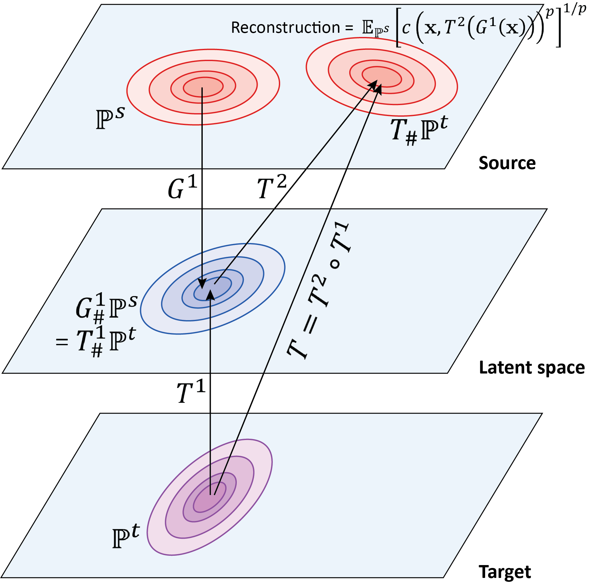

<p align="center">
  
</p>

# LAMDA: Label Matching Deep Domain Adaptation


This is the implementation of paper **[LAMDA: Label Matching Deep Domain Adaptation](http://proceedings.mlr.press/v139/le21a/le21a.pdf)** which has been accepted at ICML 2021.

<p align="center">
  
</p>


## A. Setup

### A.1. Install Package Dependencies

**Install manually**

```
Python Environment: >= 3.5
Tensorflow: >= 1.9
```

**Install automatically from YAML file**

```
pip install --upgrade pip
conda env create --file tf1.9py3.5.yml
```

**[UPDATE] Install tensorbayes**

Please note that tensorbayes 0.4.0 is out of date. Please copy a newer version to the *env* folder (tf1.9py3.5) using **tensorbayes.tar**

```
source activate tf1.9py3.5
pip install tensorbayes
tar -xvf tensorbayes.tar
cp -rf /tensorbayes/* /opt/conda/envs/tf1.9py3.5/lib/python3.5/site-packages/tensorbayes/
```

### A.2. Datasets

Please download Office-31 [here](https://drive.google.com/file/d/1dsrHn4S6lCmlTa4Eg4RAE5JRfZUIxR8G/view?usp=sharing) and unzip extracted features in the *datasets* folder. 

## B. Training

We first navigate to *model* folder, and then run *run_lamda.py* file as bellow:

```python
cd model
```

1. **A** --> **W** task

```python
python run_lamda.py 1 amazon webcam format csv num_iters 20000 summary_freq 400 learning_rate 0.0001 inorm True batch_size 310 src_class_trade_off 1.0 domain_trade_off 0.1 src_vat_trade_off 0.1 trg_trade_off 0.1 save_grads False cast_data False cnn_size small update_target_loss False m_on_D_trade_off 1.0 m_plus_1_on_D_trade_off 1.0 m_plus_1_on_G_trade_off 1.0 m_on_G_trade_off 0.1 data_path ""
```

2. **A** --> **D** task

```python
python run_lamda.py 1 amazon dslr format csv num_iters 20000 summary_freq 400 learning_rate 0.0001 inorm True batch_size 310 src_class_trade_off 1.0 domain_trade_off 0.1 src_vat_trade_off 1.0 trg_trade_off 0.1 save_grads False cast_data False cnn_size small update_target_loss False m_on_D_trade_off 1.0 m_plus_1_on_D_trade_off 1.0 m_plus_1_on_G_trade_off 1.0 m_on_G_trade_off 0.05 data_path ""
```

3. **D** --> **W** task

```python
python run_lamda.py 1 dslr webcam format csv num_iters 20000 summary_freq 400 learning_rate 0.0001 inorm True batch_size 155 src_class_trade_off 1.0 domain_trade_off 0.1 src_vat_trade_off 0.1 trg_trade_off 0.1 save_grads False cast_data False cnn_size small update_target_loss False m_on_D_trade_off 1.0 m_plus_1_on_D_trade_off 1.0 m_plus_1_on_G_trade_off 1.0 m_on_G_trade_off 0.1 data_path ""
```

4. **W** --> **D** task

```python
python run_lamda.py 1 webcam dslr format csv num_iters 20000 summary_freq 400 learning_rate 0.0001 inorm True batch_size 310 src_class_trade_off 1.0 domain_trade_off 0.1 src_vat_trade_off 0.1 trg_trade_off 0.1 save_grads False cast_data False cnn_size small update_target_loss False m_on_D_trade_off 1.0 m_plus_1_on_D_trade_off 1.0 m_plus_1_on_G_trade_off 1.0 m_on_G_trade_off 0.1 data_path ""
```

5. **D** --> **A** task

```python
python run_lamda.py 1 dslr amazon format csv num_iters 20000  sumary_freq 400 learning_rate 0.0001 inorm True batch_size 155 src_class_trade_off 1.0 domain_trade_off 0.1 src_vat_trade_off 1.0 trg_trade_off 0.1 save_grads False cast_data False cnn_size small update_target_loss False m_on_D_trade_off 1.0 m_plus_1_on_D_trade_off 1.0 m_plus_1_on_G_trade_off 1.0 m_on_G_trade_off 1.0 data_path ""
```

6. **W** --> **A** task

```python
python run_lamda.py 1 webcam amazon format csv num_iters 20000 summary_freq 400 learning_rate 0.0001 inorm True batch_size 310 src_class_trade_off 1.0 domain_trade_off 0.1 src_vat_trade_off 1.0 trg_trade_off 0.1 save_grads False cast_data False cnn_size small update_target_loss False m_on_D_trade_off 1.0 m_plus_1_on_D_trade_off 1.0 m_plus_1_on_G_trade_off 1.0 m_on_G_trade_off 1.0 data_path ""
```


## C. Results

|    Methods    | **A** --> **W** | **A** --> **D** | **D** --> **W** | **W** --> **D** | **D** --> **A** | **W** --> **A** |   Avg    |
| :-----------: | :-------------: | :-------------: | :-------------: | :-------------: | :-------------: | :-------------: | :------: |
| ResNet-50 [1] |      70.0       |      65.5       |      96.1       |      99.3       |      62.8       |      60.5       |   75.7   |
| DeepCORAL [2] |      83.0       |      71.5       |      97.9       |      98.0       |      63.7       |      64.5       |   79.8   |
|   DANN [3]    |      81.5       |      74.3       |      97.1       |      99.6       |      65.5       |      63.2       |   80.2   |
|   ADDA [4]    |      86.2       |      78.8       |      96.8       |      99.1       |      69.5       |      68.5       |   83.2   |
|   CDAN [5]    |      94.1       |      92.9       |      98.6       |    **100.0**    |      71.0       |      69.3       |   87.7   |
|    TPN [6]    |      91.2       |      89.9       |      97.7       |      99.5       |      70.5       |      73.5       |   87.1   |
| DeepJDOT [7]  |      88.9       |      88.2       |      98.5       |      99.6       |      72.1       |      70.1       |   86.2   |
|   RWOT [8]    |      95.1       |      94.5       |      99.5       |    **100.0**    |      77.5       |      77.9       |   90.8   |
|   **LAMDA**   |    **95.2**     |    **96.0**     |      98.5       |    **99.8**     |    **87.3**     |    **84.4**     | **93.0** |

## D. References

### D.1. Baselines:

[1] K. He, X. Zhang, S. Ren, and J. Sun. Deep residual learning for image recognition. In 2016 IEEE Conference on Computer Vision and Pattern Recognition (CVPR), pages 770–778, 2016.

[2] B. Sun and K. Saenko. Deep coral: Correlation alignment for deep domain adaptation. In Gang Hua and Hervé Jéegou, editors, Computer Vision – ECCV 2016 Workshops, pages 443–450, Cham, 2016. Springer International Publishing.

[3] Y. Ganin, E. Ustinova, H. Ajakan, P. Germain, H. Larochelle, F. Laviolette, M. Marchand, and V. Lempitsky. Domain-adversarial training of neural networks. J. Mach. Learn. Res., 17(1):2096–2030, jan 2016.

[4] E. Tzeng, J. Hoffman, K. Saenko, and T. Darrell. Adversarial discriminative domain adaptation. In 2017 IEEE Conference on Computer Vision and Pattern Recognition (CVPR), pages 2962–2971, 2017.

[5] M. Long, Z. Cao, J. Wang, and M. I. Jordan. Conditional adversarial domain adaptation. In Advances in Neural Information Processing Systems 31, pages 1640–1650. Curran Associates, Inc., 2018.

[6] Y. Pan, T. Yao, Y. Li, Y. Wang, C. Ngo, and T. Mei. Transferrable prototypical networks for unsupervised domain adaptation. In CVPR, pages 2234–2242, 2019.

[7] B. B. Damodaran, B. Kellenberger, R. Flamary, D. Tuia, and N. Courty. Deepjdot: Deep joint distribution optimal transport for unsupervised domain adaptation. In Computer Vision - ECCV 2018, pages 467–483. Springer, 2018.  

[8] R. Xu, P. Liu, L. Wang, C. Chen, and J. Wang. Reliable weighted optimal transport for unsupervised domain adaptation. In CVPR 2020, June 2020.

### D.2. GitHub repositories: 

- Some parts of our code (e.g., VAT, evaluation, …) are rewritten with modifications from [DIRT-T](https://github.com/RuiShu/dirt-t).
